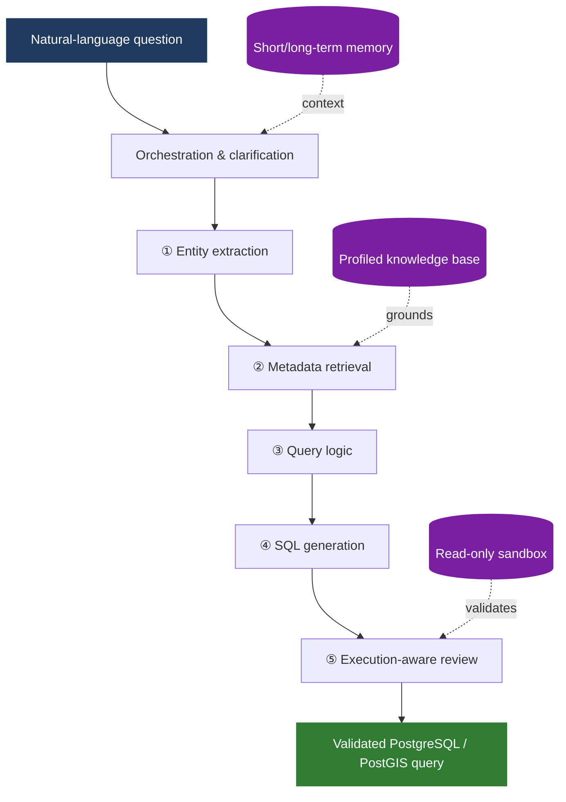

<div align="center">


<br>

<a href="https://www.python.org/"></a>
<a href="https://postgis.net/"></a>
<a href="https://doi.org/10.1080/17538947.2026.2687193"></a>
<a href="#spatialqueryqa-benchmark"></a>

<br><br>

**Translate natural-language questions into grounded, executable, and reviewed PostgreSQL / PostGIS queries.**

<samp>

 [Published Paper](https://doi.org/10.1080/17538947.2026.2687193) &nbsp;•&nbsp;
 [Appendices](docs/Manuscript_Appendices.pdf) &nbsp;•&nbsp;
 [Evaluation Data](data)

</samp>

</div>

<br>

<div align="center">

</div>

##  The problem

Spatial Text-to-SQL is more than SQL generation. A reliable system must jointly interpret geographic intent, identify the right geometry-bearing tables and columns, choose suitable spatial functions, handle coordinate reference systems and measurement units, and verify that the final query behaves as intended.

This repository accompanies the paper **"From Questions to Queries: An AI-powered Multi-Agent Framework for Spatial Text-to-SQL."** It provides the multi-agent reference implementation, a deliberately lightweight single-agent baseline, SpatialQueryQA evaluation workbooks, non-spatial benchmark results, and the manuscript appendices.

> [!NOTE]
> **Core idea** — don't ask one model to solve every part of a spatial query at once. Ground the question first, progressively constrain the solution, and test the generated SQL against database behavior.

<br>

##  How the framework works



The agents don't exchange unconstrained prose. Each stage produces **structured intermediate output** for the next stage, making the reasoning path easier to inspect and limiting downstream drift.

<table>
<thead>
<tr><th align="left">Stage</th><th align="left">Responsibility</th><th align="left">Output</th></tr>
</thead>
<tbody>
<tr><td>&nbsp;<b>Entity Extraction</b></td><td>Identifies locations, timeframes, filters, table references, and ambiguity</td><td><code>Structured user intent</code></td></tr>
<tr><td>&nbsp;<b>Metadata Retrieval</b></td><td>Maps intent to profiled tables, columns, representative values, and relevant PostGIS functions</td><td><code>Grounded schema subset</code></td></tr>
<tr><td>&nbsp;<b>Query Logic</b></td><td>Plans joins, filters, spatial operations, ordering, and aggregation before SQL is written</td><td><code>Stepwise logical plan</code></td></tr>
<tr><td>&nbsp;<b>SQL Generation</b></td><td>Translates the plan within the known schema boundary</td><td><code>Candidate PostgreSQL/PostGIS query</code></td></tr>
<tr><td>&nbsp;<b>Review</b></td><td>Runs controlled checks, examines representative results, and repairs bounded errors</td><td><code>Validated / revised query</code></td></tr>
</tbody>
</table>

###  Four design principles

<table>
<tr><td width="32%">&nbsp;<b>Separation by cognitive function</b></td><td>Interpretation, grounding, planning, generation, and validation have different failure modes.</td></tr>
<tr><td>&nbsp;<b>Grounding before generation</b></td><td>Later agents work from database evidence instead of guessed table or column names.</td></tr>
<tr><td>&nbsp;<b>Progressive constraint</b></td><td>Each structured stage narrows the solution space for the next.</td></tr>
<tr><td>&nbsp;<b>Verification after synthesis</b></td><td>Plausible SQL is not trusted until it is checked against database behavior.</td></tr>
</table>

<br>

<div align="center">

</div>

##  Results at a glance

The study used manual, rationale-based semantic evaluation because multiple SQL statements can correctly answer the same question, and exact-string matching can unfairly penalize valid alternatives.

<div align="center">

| Benchmark | Questions | Before Review | After Review | Gain |
|:--|--:|--:|--:|:--:|
| **KaggleDBQA** | 272 | 68.7% <sub>(187)</sub> | **81.2%** <sub>(221)</sub> |  `+12.5 pts` |
| **SpatialQueryQA** | 90 | 76.7% <sub>(69)</sub> | **87.7%** <sub>(79)</sub> |  `+11.0 pts` |

</div>

For SpatialQueryQA, reviewed accuracy reached **93.3%** on basic questions, **90.0%** on intermediate questions, and **80.0%** on advanced questions — the largest review-stage gain occurred on the advanced tier.

A focused 15-question single-agent comparison showed a clear complexity effect: the baseline returned expected results for **4/5** basic, **2/5** intermediate, and **0/5** advanced questions.

> [!IMPORTANT]
> This is not a claim that multi-agent systems are always preferable. Simple queries may be handled faster and more cheaply by a strong single agent — the proposed pipeline is designed for robustness on *compound* spatial tasks.

<br>

##  SpatialQueryQA benchmark

SpatialQueryQA is a coverage-oriented benchmark for spatial Text-to-SQL. Its 90 questions are distributed equally across three difficulty levels and cover diverse geometry types, workload families, spatial predicates, measurements, joins, and multi-step aggregations.

<div align="center">

| Level | Typical reasoning pattern | Questions |
|:--|:--|:--:|
| &nbsp;**Basic** | One or two direct operations | `30` |
| &nbsp;**Intermediate** | Multiple linked operations or spatial joins | `30` |
| &nbsp;**Advanced** | Multi-step spatial reasoning, aggregation, or CRS-sensitive logic | `30` |

</div>

Per-question evaluation workbooks: [`data/Spatial`](data/Spatial) (spatial) · [`data/Non-Spatial`](data/Non-Spatial) (KaggleDBQA)

<br>

##  Repository map

```text
Spatial-Text-to-SQL/
├── Codes/
│   ├── Multi-Agent.py       # Five-stage reference pipeline
│   └── Single-Agent.py      # Deliberately naive one-pass baseline
├── data/
│   ├── Spatial/             # SpatialQueryQA results by difficulty level
│   └── Non-Spatial/         # KaggleDBQA results by database
├── SQL Src/
│   ├── Spatial/             # Spatial database download information
│   └── Non-Spatial/         # Non-spatial database download information
├── docs/
│   └── Manuscript_Appendices.pdf
└── README.md
```

<br>

##  Running the reference implementation

The current code is a **research reference implementation**, not a packaged application. To run it against your own database, you'll need:

<table>
<tr><td width="8%" align="center"></td><td>Python 3.10 or newer</td></tr>
<tr><td align="center"></td><td>A PostgreSQL database with PostGIS enabled for spatial workloads</td></tr>
<tr><td align="center"></td><td>An OpenAI API key</td></tr>
<tr><td align="center"></td><td>A SQLAlchemy-compatible, preferably <b>read-only</b>, database connection</td></tr>
<tr><td align="center"></td><td>The schema-profiling artifacts expected by <code>run_pipeline</code> (metadata pickle + table/column description dictionaries)</td></tr>
</table>

**Install dependencies:**

```bash
python -m venv .venv
source .venv/bin/activate
pip install openai sqlalchemy psycopg2-binary pandas numpy requests dateparser
```

The main entry point is **`run_pipeline(...)`** in [`Codes/Multi-Agent.py`](Codes/Multi-Agent.py). It accepts the user question, database name, profiled metadata artifacts, OpenAI API key, and an explicit database connection string, and returns the final SQL together with intermediate artifacts and token/time metrics.

For a fair architectural comparison, [`Codes/Single-Agent.py`](Codes/Single-Agent.py) intentionally omits tool use, schema search, clarification, execution checks, and repair.

> [!WARNING]
> **Safety** — Generated SQL should be executed with least-privilege, read-only credentials in a controlled environment. The research design blocks data-changing and database-definition statements, but application-level deployment should add independent authorization, resource limits, logging, and query review.

<br>

##  What review fixes — what remains hard

The Review Agent substantially improved both benchmarks by detecting issues such as incorrect schema references, missing output fields, wrong filters, and incomplete aggregation. It does not eliminate every spatial reasoning failure.

<details>
<summary><b>&nbsp;Known difficult cases — click to expand</b></summary>
<br>

- Geodesic versus planar distance calculations
- Inappropriate coordinate reference systems for measurement
- Confusion between full geometries and derived boundaries
- Subtle geometry/function compatibility errors
- Complex aggregation semantics, such as returning per-feature values when a total is requested

</details>

These limitations are part of the research result and motivate future work on dedicated spatial-reasoning controls, interactive clarification during intermediate stages, and broader community-validated benchmarks.

<br>

<div align="center">

</div>

##  Citation

```bibtex
@article{khosravikazazi2026questions,
  title   = {From Questions to Queries: An AI-powered Multi-Agent Framework for Spatial Text-to-SQL},
  author  = {Khosravi Kazazi, Ali and Li, Zhenlong and Lessani, M. Naser and Cervone, Guido},
  journal = {International Journal of Digital Earth},
  year    = {2026},
  doi     = {10.1080/17538947.2026.2687193},
  url     = {https://doi.org/10.1080/17538947.2026.2687193}
}
```

##  Authors

<div align="center">

**Ali Khosravi Kazazi** · **Zhenlong Li** · **M. Naser Lessani** · **Guido Cervone**

*Department of Geography*
*The Pennsylvania State University*

</div>

<br>


